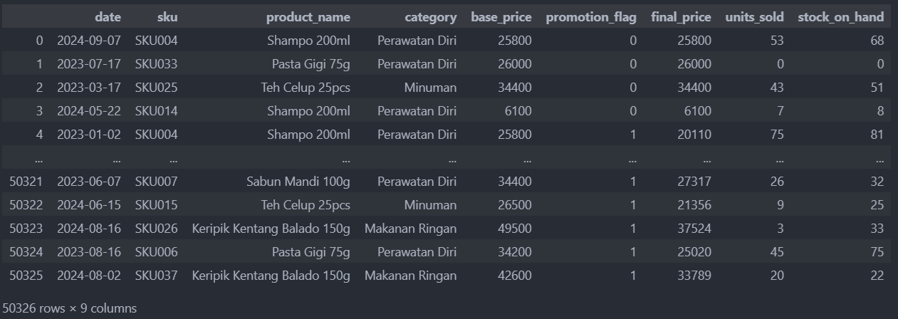
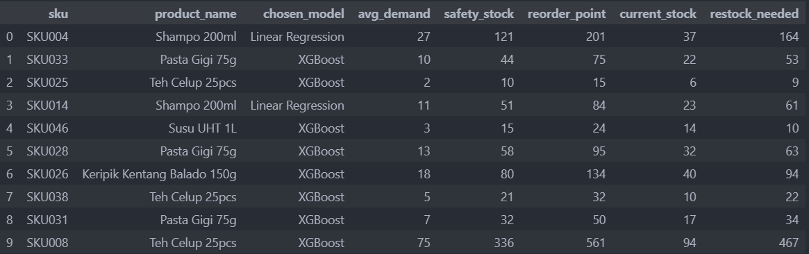

# 📦 Forecasting Stock Control Gudang  

Proyek ini merupakan portofolio analisis data & machine learning untuk **memprediksi kebutuhan stok gudang** serta memberikan rekomendasi restock.  
Model yang digunakan adalah **Linear Regression** dan **XGBoost**, kemudian dibandingkan untuk menentukan metode terbaik dalam forecasting.  

---

## 🎯 Tujuan Proyek
- Mengoptimalkan **kontrol persediaan gudang** agar lebih efisien.  
- Memprediksi **permintaan barang** berdasarkan riwayat penjualan, promosi, dan stok on-hand.  
- Memberikan insight bisnis berupa **safety stock** dan **reorder point** agar tim logistik dapat menghindari **stockout** dan **overstock**.  

---

## 📊 Dataset
- Jumlah data: ±50.000 baris.  
- Fitur utama:  
  - `date` → tanggal transaksi  
  - `sku`, `product_name`, `category` → identitas produk  
  - `base_price`, `promotion_flag`, `final_price` → informasi harga & promosi  
  - `units_sold` → jumlah unit terjual  
  - `stock_on_hand` → stok yang tersedia  

Dataset ini merepresentasikan transaksi ritel harian dengan berbagai kategori produk (perawatan diri, makanan ringan, minuman, dll).  

📷 Contoh potongan data:  

---

## ⚙️ Metodologi
1. **Preprocessing**  
   - Membersihkan data transaksi  
   - Membuat fitur baru (misalnya tren permintaan & harga promosi)  

2. **Pemodelan**  
   - **Linear Regression** → digunakan sebagai baseline model.  
   - **XGBoost** → digunakan untuk menangkap pola non-linear & interaksi fitur.  

3. **Evaluasi Model**  
   - **Mean Absolute Error (MAE)**  
   - **R² Score**  

---

## 📈 Hasil
- **Linear Regression**:  
  - MAE = **6.85**  
  - R² = **0.85**  

- **XGBoost**:  
  - MAE = **7.29**  
  - R² = **0.82**  

➡️ **Linear Regression memberikan performa lebih baik** pada dataset ini.  
Namun, pemilihan model untuk tiap produk tetap bersifat adaptif: beberapa produk lebih cocok dengan Linear Regression, sementara lainnya lebih baik dengan XGBoost.  

---

## 🔍 Insight Bisnis
- Dengan hasil forecasting, sistem dapat menghitung **average demand**, **safety stock**, dan **reorder point**.
- avg_demand (Average Demand) → Rata-rata kebutuhan/permintaan barang dalam periode tertentu. Jadi baseline kebutuhan stok.
- safety_stock → Stok pengaman untuk mengantisipasi fluktuasi permintaan atau keterlambatan pasokan.
- reorder_point → Titik ambang stok di mana gudang harus melakukan pemesanan ulang sebelum kehabisan barang.
- current_stock → Jumlah stok barang yang tersedia saat ini di gudang.
- restock_needed → Jumlah barang yang perlu dipesan agar stok kembali optimal (selisih antara reorder point dan current stock).

- Contoh rekomendasi:  
  - **Shampo 200ml**  
    - Demand rata-rata: 27  
    - Safety stock: 121  
    - Reorder point: 201  
    - Current stock: 37  
    - Restock needed: 164  

  - **Pasta Gigi 75g**  
    - Demand rata-rata: 10  
    - Safety stock: 44  
    - Reorder point: 75  
    - Current stock: 22  
    - Restock needed: 53  

📷 Visualisasi hasil forecasting:  

- Dampak bisnis:  
  - Mengurangi risiko **kehabisan stok** produk dengan demand tinggi.  
  - Mengurangi biaya **overstock** karena prediksi lebih akurat.  
  - Membantu manajemen gudang membuat keputusan **restock berbasis data**.  

---

## 🚀 Pengembangan Lanjutan
- Menambahkan data maksimal kapasitas barang di gudang
- Menambahkan metode lain seperti **ARIMA** atau **LSTM** untuk data deret waktu.  
- Integrasi ke **dashboard monitoring stok real-time** untuk tim gudang.  
- Optimasi hyperparameter lebih lanjut untuk meningkatkan performa XGBoost.  

---

## ✍️ Kontributor
- Fachri Hidayah Maliki Saddam  

